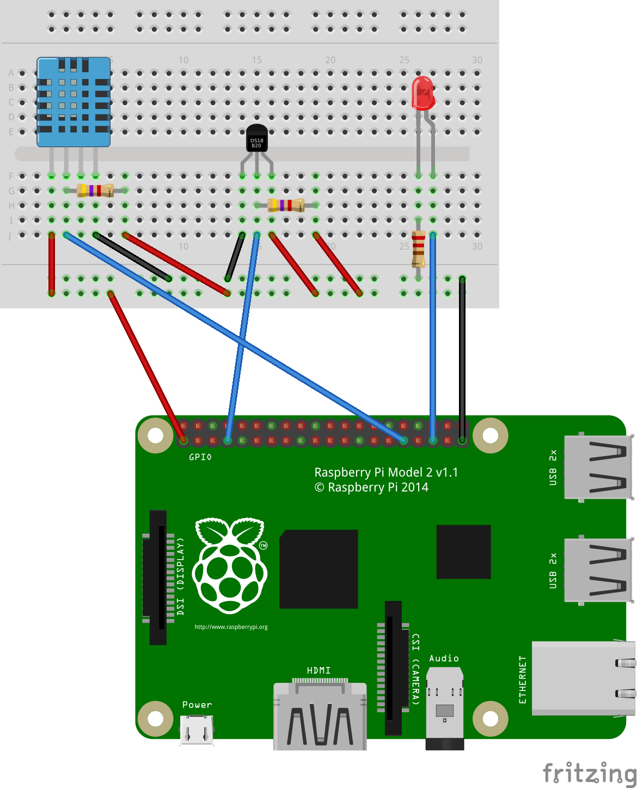

=========
HelloWord
=========

Goal
====

Create a raspberry appliance server which will report :

- the temperature of the CPU
- the temperature of a onewire sensor
- the temperature of a DHT sensor

Needed parts
============

- 1 x DHT sensor
- 1 x DS18B20 onewire sensor
- 1 x red led
- 2 x 4.7 kOhm resistor
- 1 x 330 Ohm resistor (for the LED)
- a breadboard
- a raspberry

Fritzing
========

Connect everything using the following schema :

Pins
----

- DHT : GPIO 6
- LED : GPIO 19
- ONEWIRE : GPIO 4
