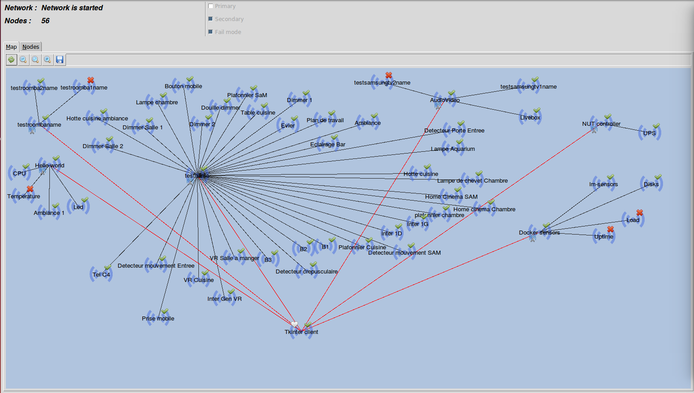
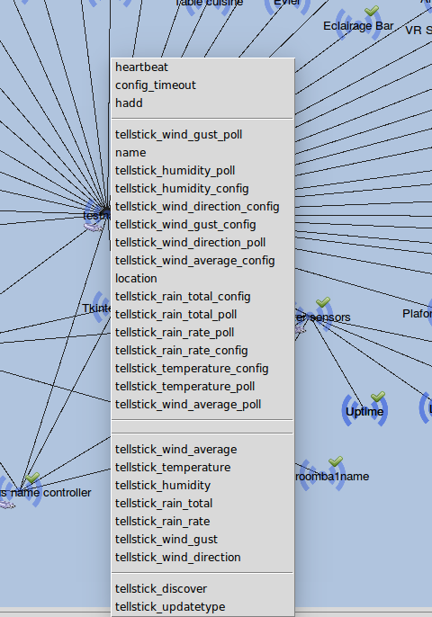
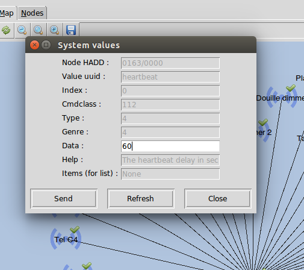
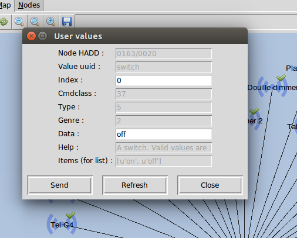

================
TK User Interface
================

Goal
====

- Install the Tk user interface and use it

Installation
============

Clone the project from github :

.. code:: bash

    $ sudo make module=janitoo_tkinter clone

Installation
============

And launch it :

.. code:: bash

    $ jnt_tkui -c /opt/janitoo/src/janitoo_tkui/src/config/janitoo_tkui.conf

The map
=======

After a while, the network is fully started :

You can now use the contextual menu.

The contextual menu
===================

Choose a value :

For example, update the heartbeat :

Use send to updat ethe value. Refresh will read it from the network.

Some values need special data, ie the swtich one : you must send on or off.
You can find the available values in list_items (the last line) :

Future
======

Like other tools in Janitoo, the UI is a work in progress.

